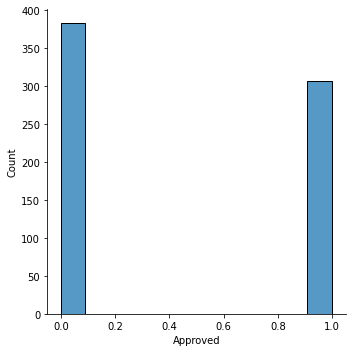
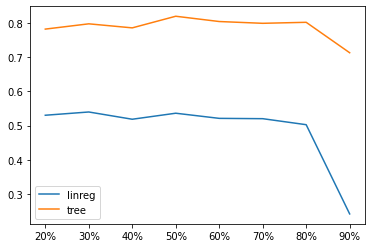
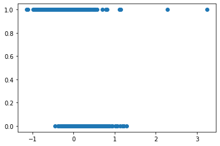
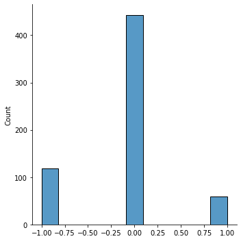

# 4200MLProject2
https://www.kaggle.com/datasets/samuelcortinhas/credit-card-approval-clean-data

 
Approved (1) or not approved (0) for a credit card. The goal is to automatically determine if someone should be approved based on historic data. 

All columns were kept because they may hold some predictive value. Note--depending on the use of this model, it may be worth removing Gender/Ethnicity for ethical reasons. Industry, Ethnicity, and Citizen are all non-ordinal data and so they were label encoded. all other data is numeric. 

 
Linear regression vs decision tree classifier performance. 

 
Residuals are clustered around 0, with a few outliers to the left and right. Part of the residuals are stuck to the left on the 1 side, and part of the residuals are stuck to the right on the 0 side. Notably, the residuals are larger than the max variance in the dataset. 

 
In research I found a library called dtreeviz that extends the default sklearn tree visualizer. I was unable to get this library to work. I found another method of visualization based on plotting the density of correct/incorrect predictions by class. This graph shows the prediction error against the frequency of that error. This reveals, for example, that the model tends to falsely not approve more than falsely approve. 
